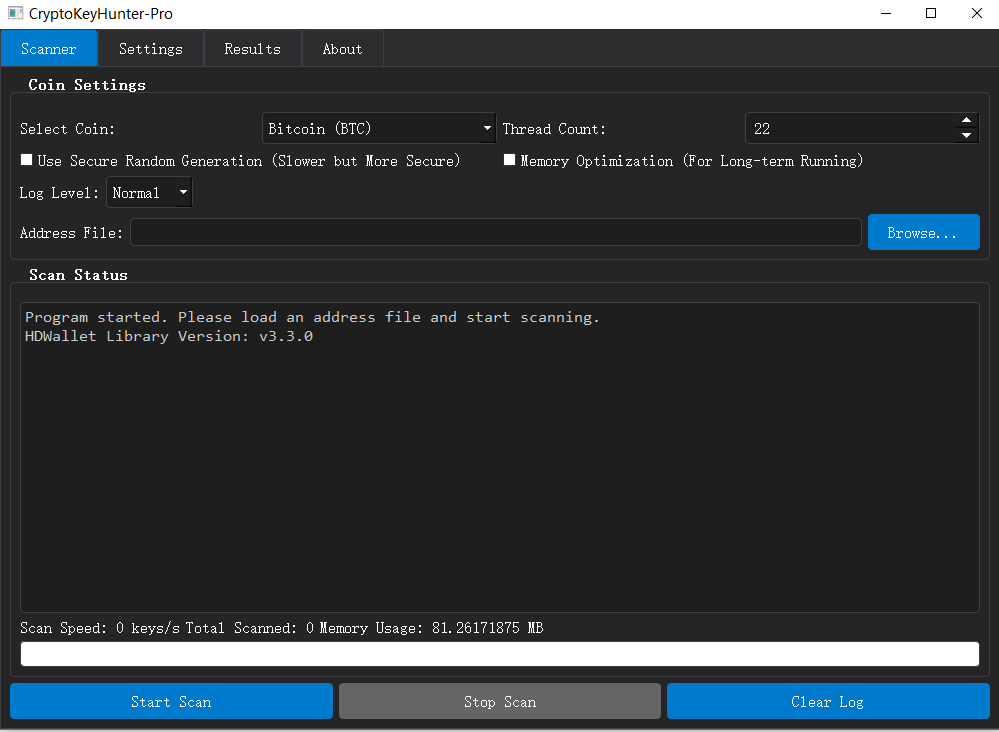

# 🔥 CryptoKeyHunter-Pro 加密货币私钥碰撞工具 🔥

[🇨🇳 中文](#zh-cn) | [🇬🇧 English](#en)

## 💥 什么是私钥碰撞？

**私钥碰撞是一种数学上的"暴力破解"方法，通过随机生成私钥并检查对应的公钥地址是否与目标地址匹配。这就像在宇宙中所有沙粒里找一粒特定的沙子，几乎不可能成功，但技术上可行.也有身边的朋友成功过,所以一切都是天意。**

本工具支持多种主流加密货币：
- 比特币 (BTC)
- 以太坊 (ETH)
- 波场 (TRX)
- 狗狗币 (DOGE)
- 莱特币 (LTC)
- 索拉纳 (SOL)

## 🚀 极致优化技术

我们在碰撞算法上做了极致优化：

1. **多线程并行处理** - 充分利用多核CPU，每秒可生成数百万个私钥
2. **内存优化模式** - 智能管理内存使用，长时间运行也不会耗尽系统资源
3. **批处理技术** - 批量生成和验证私钥，大幅提升处理效率
4. **自适应HDWallet库** - 兼容多个版本的加密库，确保最大兼容性
5. **智能错误处理** - 即使单个私钥生成失败也不会中断整体扫描过程

## ⚠️ 残酷现实警告

**让我们直面现实：**

1. 成功碰撞的概率低到令人发指 - 不过总比卖彩票强一些
2. 你的电费支出将远远超过可能的收益
3. 你的电脑将全力运转，可能会加速硬件老化
4. 这基本上是一场数学游戏，而不是实用工具

**本工具仅供学习和娱乐，不要对它抱有不切实际的期望！**

## 🔧 主要功能

- 多币种支持，一键切换不同加密货币
- 多线程扫描，充分利用CPU性能
- 实时速度监控和内存使用统计
- 自动保存和导出碰撞结果
- 可选的安全随机数生成（更安全但较慢）
- 内存优化选项，适合长时间运行
- 详细的日志记录和状态显示

## 📊 性能参考

在普通家用电脑上（8核CPU），本工具可达到：
- 每秒生成约500万-1000万个私钥
- 24小时可扫描超过4000亿个私钥
- 内存占用可控制在200-500MB范围内

## 🔗 交流与支持

- **Telegram讨论群**: [https://t.me/Satoshist01](https://t.me/Satoshist01)

## 💰 打赏支持

如果你觉得这个工具有趣或有帮助，可以考虑打赏支持开发者：

- **TORN**: TBmgsqofFCdWUxkpuunhQFSK32ubMVLZ8j
- **EVM**: 0xade41dd0ddfb952140dbfdf4787b5a6cbdf88375

## 📝 免责声明

**本工具仅供教育和娱乐目的使用。**

- 使用本工具尝试访问他人的加密货币账户是非法的，可能导致严重的法律后果
- 作者不对使用本工具造成的任何损失或法律问题负责
- 随机生成私钥并找到有效地址的概率极其低，几乎不可能

## 🔄 安装与使用

1. 下载并解压程序
2. 运行 `CryptoKeyHunter-Pro.exe`
3. 选择币种和线程数
4. 加载地址文件
5. 点击"开始扫描"
6. 坐下来，喝杯咖啡，思考宇宙的浩瀚和随机数的奇妙

**记住：这更像是一个数学实验，而不是挖矿工具。享受过程，不要期待结果！**

---

# English Version

## 💥 What is Private Key Collision?

**Private key collision is a mathematical "brute force" method that randomly generates private keys and checks if the corresponding public key address matches a target address. It's like finding a specific grain of sand among all the sand in the universe - almost impossible to succeed, but technically feasible. Some people have succeeded by sheer luck, so everything is possible.**

This tool supports multiple mainstream cryptocurrencies:
- Bitcoin (BTC)
- Ethereum (ETH)
- Tron (TRX)
- Dogecoin (DOGE)
- Litecoin (LTC)
- Solana (SOL)

## 🚀 Extreme Optimization Technology

We've made extreme optimizations to the collision algorithm:

1. **Multi-threaded Parallel Processing** - Fully utilizes multi-core CPUs, generating millions of private keys per second
2. **Memory Optimization Mode** - Intelligently manages memory usage, preventing system resource depletion during long runs
3. **Batch Processing Technology** - Generates and verifies private keys in batches, greatly improving processing efficiency
4. **Adaptive HDWallet Library** - Compatible with multiple versions of encryption libraries, ensuring maximum compatibility
5. **Smart Error Handling** - Even if a single private key generation fails, it won't interrupt the overall scanning process

## ⚠️ Harsh Reality Warning

**Let's face reality:**

1. The probability of a successful collision is incredibly low - though still better than buying lottery tickets
2. Your electricity costs will far exceed any potential returns
3. Your computer will run at full capacity, potentially accelerating hardware aging
4. This is basically a mathematical game, not a practical tool

**This tool is for learning and entertainment only. Don't have unrealistic expectations!**

## 🔧 Main Features

- Multi-cryptocurrency support, switch between different cryptocurrencies with one click
- Multi-threaded scanning, fully utilizing CPU performance
- Real-time speed monitoring and memory usage statistics
- Automatic saving and exporting of collision results
- Optional secure random number generation (more secure but slower)
- Memory optimization options, suitable for long-term operation
- Detailed logging and status display

## 📊 Performance Reference

On a typical home computer (8-core CPU), this tool can achieve:
- Generating approximately 5-10 million private keys per second
- Scanning over 400 billion private keys in 24 hours
- Memory usage controlled within the 200-500MB range

## 🔗 Communication and Support

- **Telegram Discussion Group**: [https://t.me/Satoshist01](https://t.me/Satoshist01)

## 💰 Donation Support

If you find this tool interesting or helpful, consider donating to support the developer:

- **TORN**: TBmgsqofFCdWUxkpuunhQFSK32ubMVLZ8j
- **EVM**: 0xade41dd0ddfb952140dbfdf4787b5a6cbdf88375

## 📝 Disclaimer

**This tool is for educational and entertainment purposes only.**

- Using this tool to attempt to access someone else's cryptocurrency accounts is illegal and may result in serious legal consequences
- The author is not responsible for any losses or legal issues caused by using this tool
- The probability of randomly generating a private key and finding a valid address is extremely low, almost impossible

## 🔄 Installation and Usage

1. Download and extract the program
2. Run `CryptoKeyHunter-Pro.exe`
3. Select cryptocurrency and number of threads
4. Load address file
5. Click "Start Scan"
6. Sit back, have a cup of coffee, and contemplate the vastness of the universe and the wonder of random numbers

**Remember: This is more like a mathematical experiment, not a mining tool. Enjoy the process, don't expect results!**
